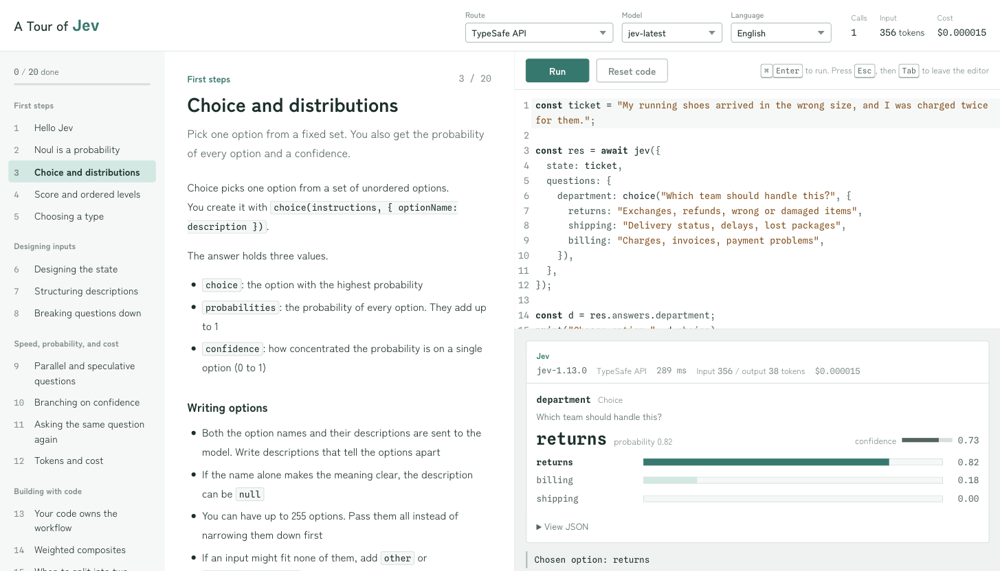

# A Tour of Jev

[日本語](README.ja.md)



A local, hands-on tutorial for Jev, the System One model from TypeSafe AI.
As in A Tour of Go, you read a lesson on the left, then edit and run code on the right.
Answers appear as probability readouts: a scale for Noul, bars for Choice, and a ruler for Score.

This is not an official TypeSafe AI tutorial.
The content is based on the [TypeSafe documentation](https://docs.typesafe.ai).

The interface and the lessons are available in English and Japanese.
Switch between them with the Language menu at the top of the page.

## Getting started

You need [Bun](https://bun.sh) 1.3 or later (`mise install` sets it up).

```bash
git clone https://github.com/bigdra50/a-tour-of-jev.git
cd a-tour-of-jev
bun install
cp .env.example .env.local   # put your keys here
bun run dev                  # http://localhost:8765
```

## API keys

Keys are used only inside the local server and are never sent to the browser.
The server reads both the variables exported in your shell and `.env.local`.

| Variable | Used for |
| --- | --- |
| `TYPESAFE_API_KEY` | Calling the TypeSafe API directly (`POST https://api.typesafe.ai/v1/systemone`) |
| `AI_GATEWAY_API_KEY` | Calling Jev through Vercel AI Gateway, and the lessons that compare or combine Jev with small LLMs |

- A key that starts with `vck_` is treated as a Vercel AI Gateway key, whatever variable it is in
- You can keep a Gateway key in your shell's `TYPESAFE_API_KEY` and put a TypeSafe key in `TYPESAFE_API_KEY` in `.env.local`. Both are used
- Switch between the TypeSafe API and Vercel AI Gateway with the Route menu at the top of the page

## Lessons

| Part | Lessons |
| --- | --- |
| First steps | Hello Jev, Noul, Choice, Score, choosing a type |
| Designing inputs | Designing the state, structuring descriptions, breaking questions down |
| Speed, probability, and cost | Parallel and speculative questions, branching on confidence, asking the same question again, tokens and cost |
| Building with code | Workflows, weighted composites, when to split into two calls |
| Limits and combinations | What Jev is bad at, using Japanese, comparing with a small LLM, combining with an LLM, the AI SDK and Gateway |

The last page, Playground, is a scratchpad with no exercise.
Your code and progress are saved in the browser.

## Development

```bash
bun run check        # typecheck + Biome + secretlint + tests
bun test             # tests only
bun run secretlint   # scan for leaked keys only
```

`bun install` enables `.githooks/pre-commit`, which scans the files you commit with secretlint.
Besides the Vercel AI Gateway keys covered by the recommended rules, it also detects TypeSafe keys (which start with `apikey_`).

| Path | Contents |
| --- | --- |
| `src/contract/` | Jev's HTTP contract, and the types, validation, and pricing of this tutorial's server API |
| `src/server/` | The Bun server: key resolution and three upstreams (TypeSafe API, Gateway, small LLMs) |
| `src/web/runner/` | Runs the learner's code in a Web Worker |
| `src/web/lessons/` | Lesson text and exercise checks. Starter code is in `code/ja/*.js` and `code/en/*.js` |
| `src/web/app/` | The React UI. Its text is in `i18n.tsx` |

To add a lesson, put its starter code in `src/web/lessons/code/ja/` and `code/en/`, and write its text in both languages in the part's file.
The tests check two things.

- Every lesson's starter code runs to the end against a fake API, which catches syntax errors and misspelled properties
- The Japanese and English starter code send the same requests to the API

Setting `TYPESAFE_BASE_URL` changes where the TypeSafe API route connects (the same variable name as the official SDK).
